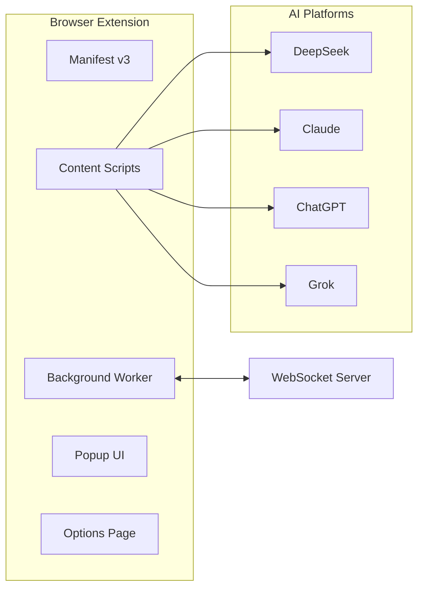
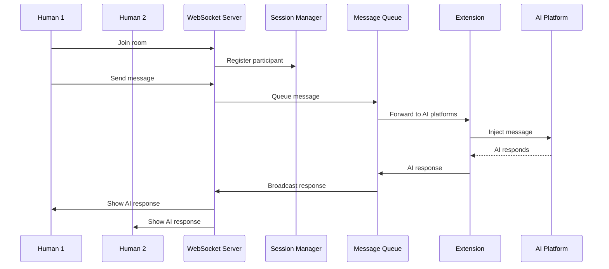
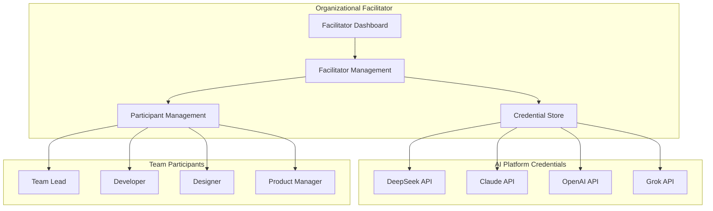
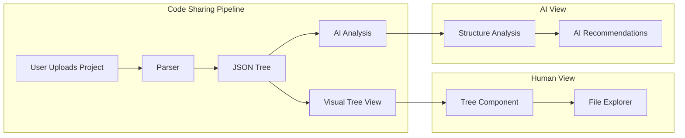
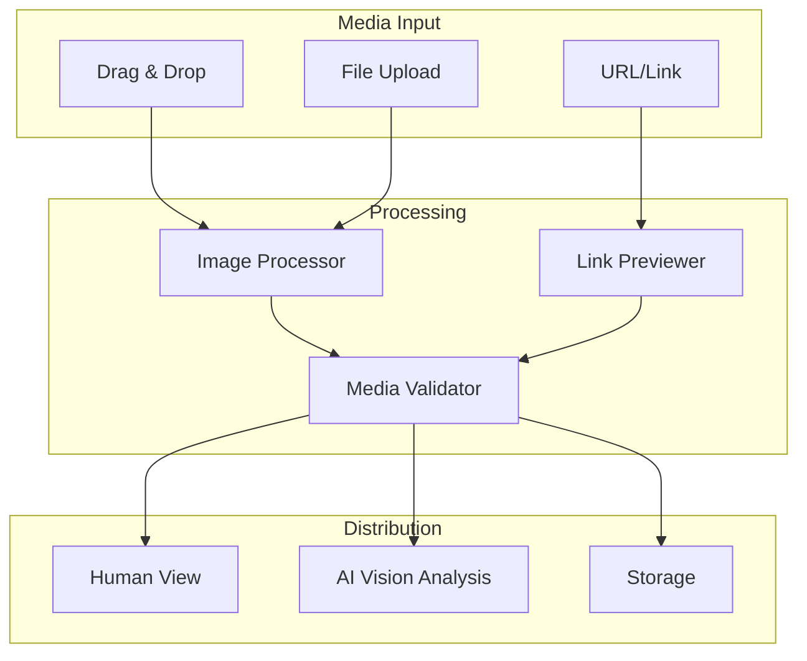
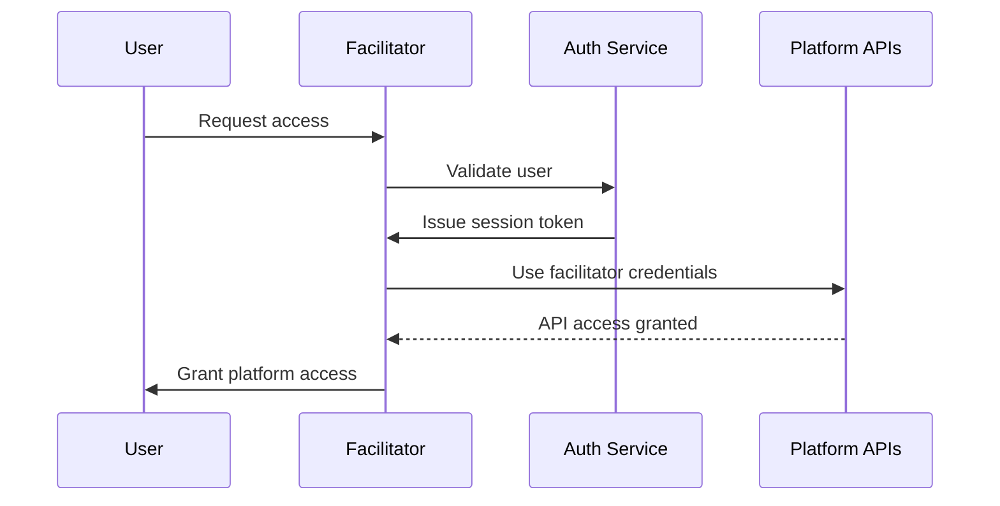
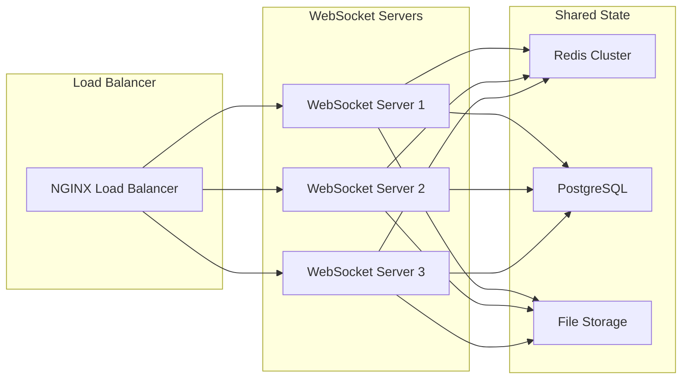

# Multi-AI Chat Platform Architecture

## System Overview

The Multi-AI Chat Platform represents a paradigm shift from isolated AI interactions to collaborative multi-participant environments. This document outlines the technical architecture required to support real-time collaboration between multiple humans and AI systems.

## Core Components

### 1. Browser Extension Layer



#### Content Script Architecture
Each AI platform requires a specialized content script:

```javascript
// Platform-specific observer pattern
class AIObserver {
  constructor(platform, selectors) {
    this.platform = platform;
    this.selectors = selectors;
    this.threadId = crypto.randomUUID();
  }
  
  startObserving() {
    // Platform-specific DOM monitoring
    // Message classification and extraction
    // Real-time forwarding to WebSocket server
  }
}
```

### 2. Real-Time Communication Layer



### 3. Facilitator Model Architecture



## Rich Media Architecture

### Code Project Sharing



### Image and Media Pipeline



## Data Models

### Session Model
```typescript
interface ChatSession {
  id: string;
  facilitatorId: string;
  participants: Participant[];
  aiPlatforms: AIplatform[];
  richMediaItems: MediaItem[];
  createdAt: Date;
  status: 'active' | 'paused' | 'ended';
}
```

### Message Model
```typescript
interface Message {
  id: string;
  sessionId: string;
  senderId: string;
  senderType: 'human' | 'ai';
  platform?: string; // for AI messages
  content: string;
  mediaAttachments?: MediaItem[];
  timestamp: Date;
  threadId?: string;
}
```

### Rich Media Model
```typescript
interface MediaItem {
  id: string;
  type: 'code' | 'image' | 'link' | 'document';
  content: any;
  metadata: {
    filename?: string;
    language?: string;
    size?: number;
    preview?: string;
  };
  uploadedBy: string;
  createdAt: Date;
}
```

## Security Architecture

### Authentication Flow


### Privacy & Security Measures
- **End-to-End Encryption**: All WebSocket communications encrypted
- **Credential Isolation**: Facilitator credentials never exposed to participants
- **Session Isolation**: Each chat session has unique encryption keys
- **Audit Logging**: All actions logged for compliance and debugging
- **Rate Limiting**: Prevent abuse of AI platform APIs

## Scalability Considerations

### Horizontal Scaling


## Technology Stack

### Frontend (Browser Extension)
- **Manifest v3** - Modern Chrome extension architecture
- **TypeScript** - Type-safe development
- **React** - UI components for complex interfaces
- **WebSocket Client** - Real-time communication

### Backend (Server)
- **Node.js + FastAPI** - Dual language support for different components
- **WebSocket.io** - Real-time bidirectional communication
- **Redis** - Session management and message queuing
- **PostgreSQL** - Persistent data storage
- **AWS S3/CloudFlare R2** - Rich media storage

### AI Integration
- **Platform APIs** - Native API integration where available
- **DOM Automation** - Browser automation for platforms without APIs
- **Vision APIs** - Image analysis capabilities
- **Context Management** - Conversation history and state management

## Development Phases

### Phase 1: Core Platform (Current)
- ✅ Browser extension with basic AI monitoring
- ✅ Simple webhook integration
- ✅ Single-user functionality

### Phase 2: Multi-Human Support
- 🔄 WebSocket server implementation
- 🔄 Real-time multi-participant chat
- 🔄 Basic facilitator model

### Phase 3: Rich Media Integration
- ⏳ Code project sharing
- ⏳ Image drag-and-drop
- ⏳ Link previews and context

### Phase 4: Enterprise Features
- ⏳ Advanced facilitator dashboard
- ⏳ Team management and permissions
- ⏳ Analytics and reporting
- ⏳ Enterprise security features

### Phase 5: AI Enhancement
- ⏳ AI-to-AI direct communication
- ⏳ Intelligent conversation routing
- ⏳ Automated facilitation features
- ⏳ Custom AI persona creation

This architecture supports the evolution from a simple browser extension to a comprehensive collaborative AI platform, setting the foundation for unprecedented human-AI collaboration scenarios.