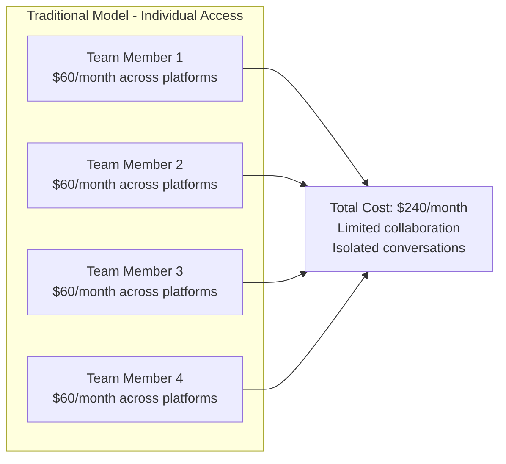
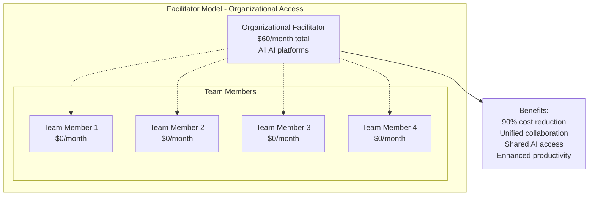
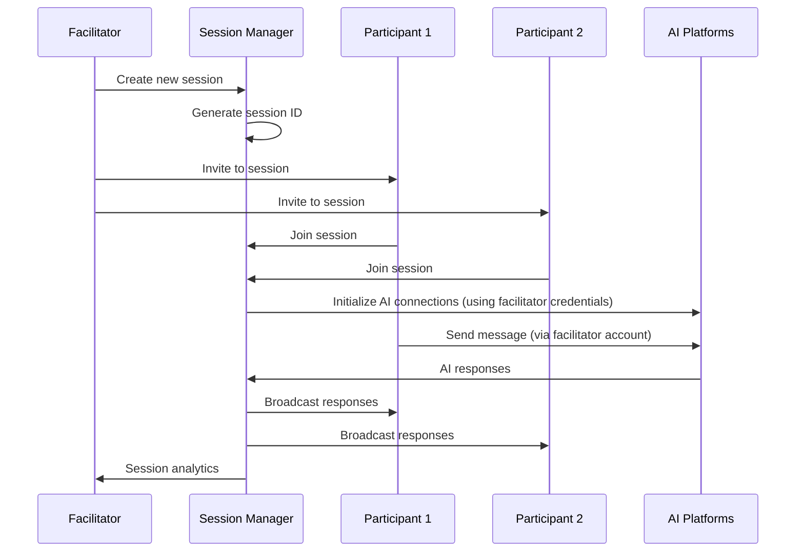
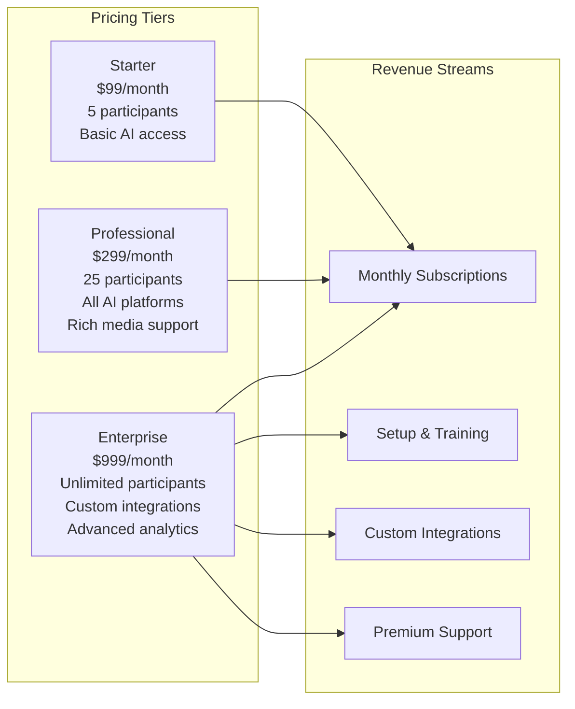
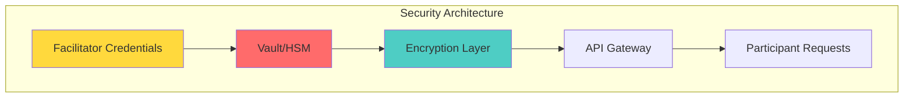
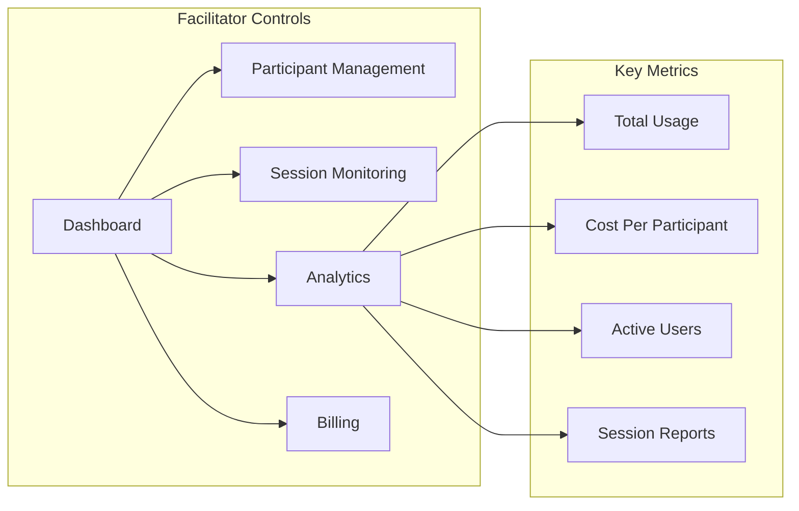

# Organizational Facilitator Model

## Overview

The Facilitator Model is a revolutionary approach that transforms expensive individual AI subscriptions into cost-effective organizational access. This model enables teams to collaborate with multiple AI platforms through a single facilitator account, dramatically reducing costs and complexity.

## The Problem

### Current AI Access Challenges


**Cost Analysis:**
- ChatGPT Plus: $20/month
- Claude Pro: $20/month  
- DeepSeek (estimated): $10/month
- Grok Premium: $8/month
- **Per person**: ~$58/month
- **4-person team**: $232/month
- **10-person team**: $580/month

## Our Solution: Facilitator Model



**Cost Savings:**
- **Traditional 4-person team**: $232/month
- **Facilitator model**: $60/month
- **Savings**: $172/month (74% reduction)
- **ROI**: 386% cost efficiency

## Implementation Architecture

### Role Definitions

#### Organizational Facilitator
```typescript
interface Facilitator {
  id: string;
  organizationId: string;
  role: 'admin' | 'facilitator';
  aiPlatformCredentials: {
    chatgpt: APICredentials;
    claude: APICredentials;
    deepseek: APICredentials;
    grok: APICredentials;
  };
  permissions: FacilitatorPermissions;
  billingInfo: BillingDetails;
}
```

#### Team Participants
```typescript
interface Participant {
  id: string;
  organizationId: string;
  role: 'team_lead' | 'developer' | 'designer' | 'product_manager' | 'member';
  accessLevel: 'full' | 'limited' | 'read_only';
  allowedPlatforms: AIplatform[];
  joinedAt: Date;
}
```

### Access Control Matrix

| Role | Create Sessions | Invite Participants | Access All AIs | Manage Settings | View Analytics |
|------|----------------|-------------------|-----------------|-----------------|----------------|
| **Facilitator** | ✅ | ✅ | ✅ | ✅ | ✅ |
| **Team Lead** | ✅ | ✅ | ✅ | ❌ | ✅ |
| **Developer** | ✅ | ✅ | ✅ | ❌ | ❌ |
| **Designer** | ✅ | ✅ | ✅ | ❌ | ❌ |
| **Member** | ❌ | ❌ | ✅ | ❌ | ❌ |

### Session Management Flow



## Business Models

### 1. Enterprise SaaS Model


### 2. Managed Service Model
- **White-label solution** for enterprises
- **Dedicated facilitator accounts** managed by us
- **Custom branding** and integration
- **Premium support** and training

### 3. Hybrid Model
- **Basic platform** free/low-cost
- **Premium AI access** via facilitator subscriptions
- **Enterprise features** as paid add-ons

## Technical Implementation

### Credential Security


**Security Features:**
- **Hardware Security Modules (HSM)** for credential storage
- **Zero-trust architecture** - participants never see credentials
- **API gateway** with rate limiting and request validation
- **Audit logging** for all credential usage
- **Automatic credential rotation** for enhanced security

### Load Balancing & Scaling
```typescript
class FacilitatorManager {
  private facilitators: Map<string, Facilitator> = new Map();
  private loadBalancer: LoadBalancer;
  
  async routeRequest(participantId: string, aiPlatform: string) {
    const facilitator = await this.findOptimalFacilitator(aiPlatform);
    return this.loadBalancer.route(facilitator, participantId);
  }
  
  private async findOptimalFacilitator(platform: string): Promise<Facilitator> {
    // Load balancing algorithm considering:
    // - Current usage
    // - Rate limits
    // - Geographic proximity
    // - Platform-specific optimizations
  }
}
```

## User Experience

### Facilitator Dashboard


### Participant Experience
1. **Seamless Onboarding**: Invited by facilitator, no individual AI subscriptions needed
2. **Unified Interface**: Access all AI platforms through single interface
3. **Collaborative Features**: Real-time multi-participant discussions
4. **Rich Media Support**: Share code, images, links seamlessly

## Implementation Roadmap

### Phase 1: MVP (Months 1-2)
- [ ] Basic facilitator account creation
- [ ] Simple participant invitation system
- [ ] Single-session support
- [ ] Basic credential management

### Phase 2: Multi-Session Support (Months 2-3)
- [ ] Multiple concurrent sessions
- [ ] Session persistence and history
- [ ] Basic analytics dashboard
- [ ] Participant role management

### Phase 3: Enterprise Features (Months 3-6)
- [ ] Advanced security features
- [ ] Custom integrations
- [ ] Comprehensive analytics
- [ ] White-label options

### Phase 4: Scale & Optimize (Months 6-12)
- [ ] Auto-scaling infrastructure
- [ ] Advanced load balancing
- [ ] Machine learning optimization
- [ ] Global deployment

## Success Metrics

### Business Metrics
- **Cost Reduction**: Target 70%+ savings vs individual subscriptions
- **User Adoption**: 10,000+ participants within 12 months
- **Revenue Growth**: $1M ARR by end of Year 1
- **Customer Retention**: 90%+ retention rate

### Technical Metrics
- **Session Success Rate**: 99.9% uptime
- **Response Time**: <100ms for message routing
- **Concurrent Users**: Support 1,000+ simultaneous users
- **Security**: Zero credential breaches

The Facilitator Model transforms AI collaboration from an expensive individual luxury to an accessible organizational capability, democratizing access to multiple AI platforms while enabling unprecedented collaborative scenarios.