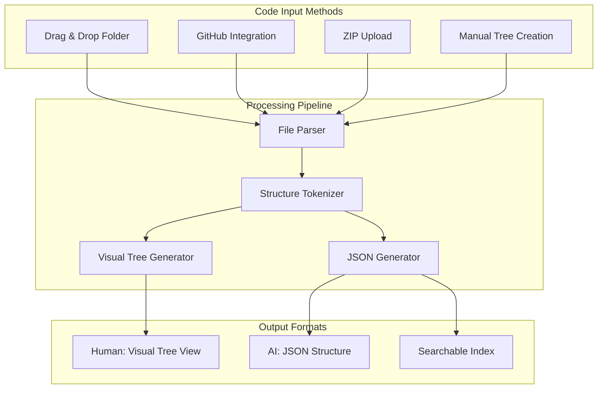
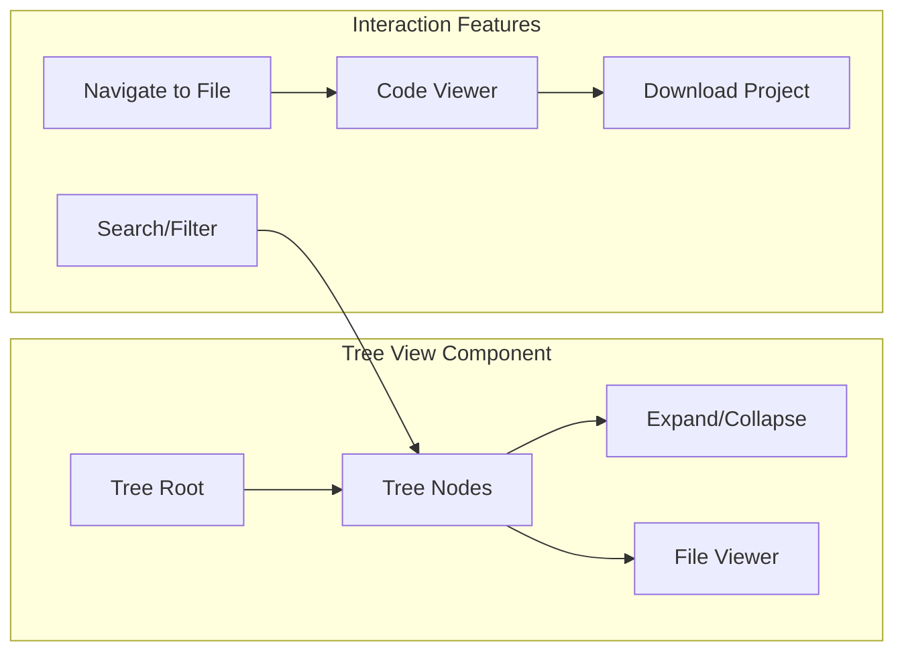
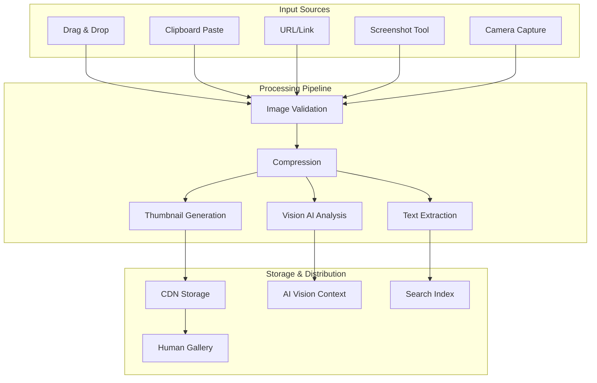
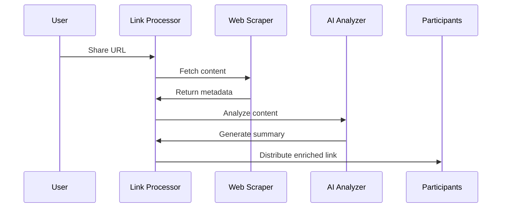
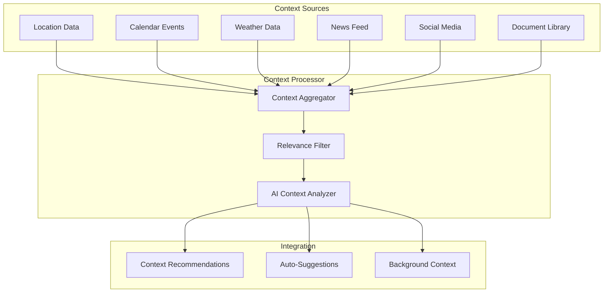
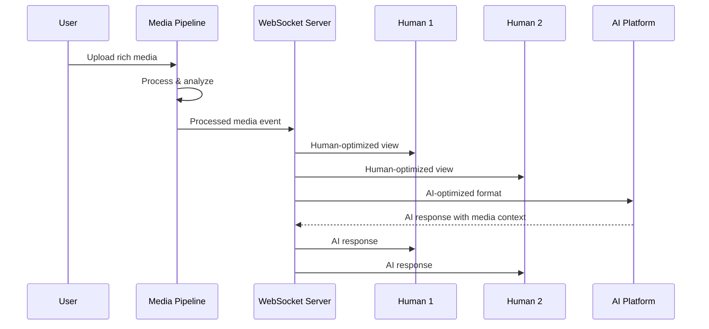
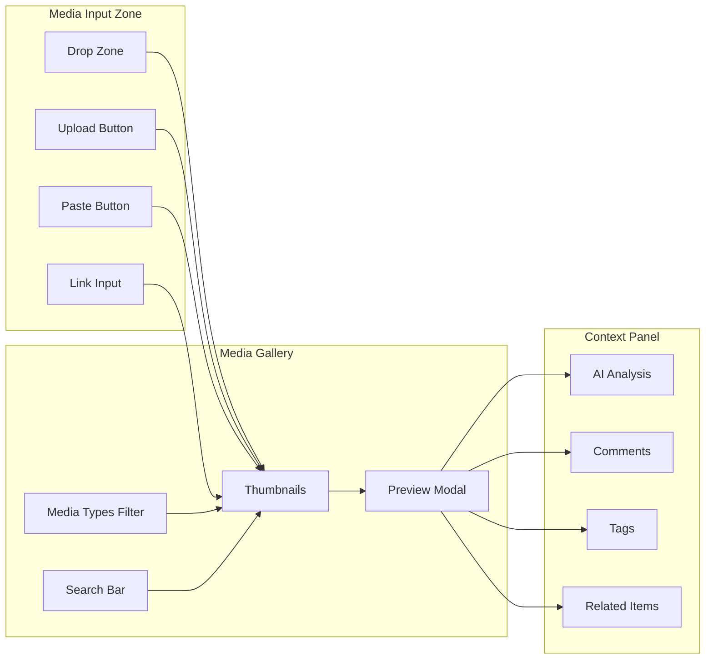
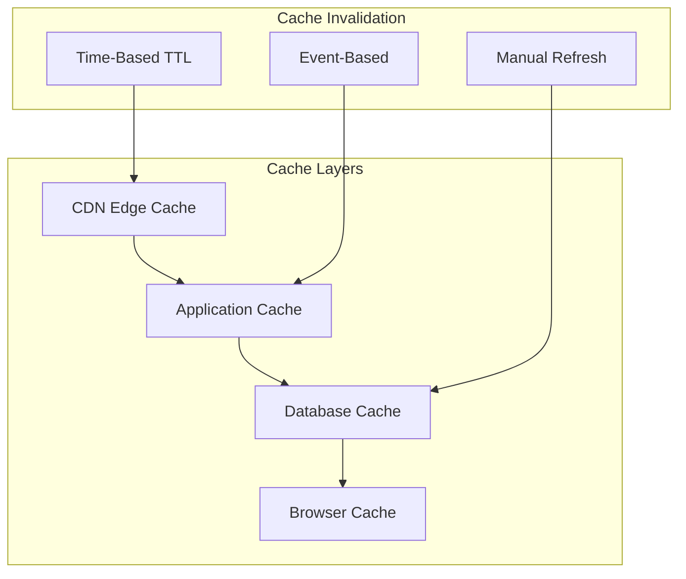
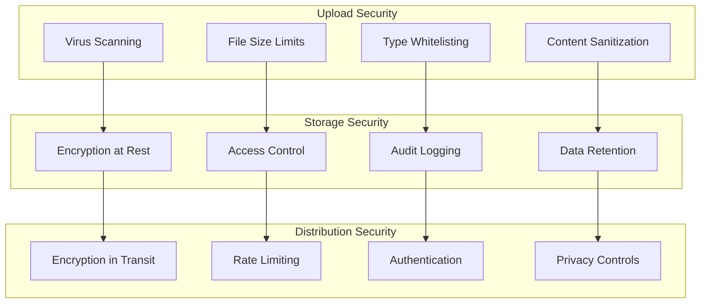

# Rich Media Support Architecture

## Overview

Rich media support transforms the Multi-AI Chat Platform from simple text conversations to comprehensive collaborative sessions. This document outlines the architecture for handling code projects, images, links, and contextual content in real-time multi-participant environments.

## Content Types & Use Cases

### 1. Code Project Sharing

#### Problem Statement
- **Human Challenge**: Viewing complex folder structures as JSON is difficult
- **AI Advantage**: AIs parse JSON folder structures instantly
- **Solution**: Bidirectional conversion between visual tree views and JSON representations

#### Architecture



#### Data Models

```typescript
interface CodeProject {
  id: string;
  name: string;
  description?: string;
  structure: FileSystemNode;
  metadata: {
    language: string[];
    size: number;
    fileCount: number;
    lastModified: Date;
  };
  uploadedBy: string;
  sharedAt: Date;
}

interface FileSystemNode {
  name: string;
  type: 'file' | 'directory';
  path: string;
  size?: number;
  content?: string; // For text files
  language?: string;
  children?: FileSystemNode[];
}
```

#### Human Interface Components



### 2. Image & Visual Content

#### Supported Formats & Processing



#### AI Vision Integration

```typescript
interface ImageAnalysis {
  id: string;
  imageId: string;
  platform: 'claude' | 'chatgpt' | 'grok';
  analysis: {
    description: string;
    objects: DetectedObject[];
    text: string; // OCR results
    sentiment: string;
    technicalDetails?: TechnicalAnalysis;
  };
  confidence: number;
  processedAt: Date;
}

interface DetectedObject {
  name: string;
  confidence: number;
  boundingBox: BoundingBox;
  attributes: string[];
}
```

### 3. Link & URL Enrichment

#### Smart Link Processing



#### Link Enrichment Data Model

```typescript
interface EnrichedLink {
  id: string;
  originalUrl: string;
  cleanUrl: string;
  metadata: {
    title: string;
    description: string;
    image: string;
    siteName: string;
    publishedDate?: Date;
    author?: string;
  };
  content: {
    summary: string; // AI-generated
    keyPoints: string[];
    relevantQuotes: string[];
    readTime: number;
  };
  aiAnalysis?: {
    topics: string[];
    sentiment: string;
    relevanceScore: number;
  };
  sharedBy: string;
  sharedAt: Date;
}
```

### 4. Contextual Content Integration

#### Real-World Context Sources



## Implementation Architecture

### Media Pipeline Architecture

```typescript
class MediaPipeline {
  private processors: Map<ContentType, MediaProcessor> = new Map();
  private storage: MediaStorage;
  private aiIntegration: AIVisionService;
  
  async processMedia(content: MediaContent): Promise<ProcessedMedia> {
    // 1. Validate and sanitize
    const validated = await this.validate(content);
    
    // 2. Process based on type
    const processor = this.processors.get(content.type);
    const processed = await processor.process(validated);
    
    // 3. Generate AI analysis
    const aiAnalysis = await this.aiIntegration.analyze(processed);
    
    // 4. Store and index
    const stored = await this.storage.store(processed);
    await this.indexForSearch(processed, aiAnalysis);
    
    // 5. Distribute to participants
    await this.distribute(stored, aiAnalysis);
    
    return processed;
  }
}
```

### Real-Time Distribution



## User Experience Design

### Unified Media Interface



### Progressive Enhancement Strategy

#### Level 1: Basic Media Support
- Simple image upload/display
- Basic link previews
- Text file sharing

#### Level 2: Enhanced Processing
- Image compression and optimization
- Rich link metadata extraction
- Code syntax highlighting

#### Level 3: AI Integration
- Vision AI analysis
- Automatic tagging
- Content recommendations

#### Level 4: Advanced Features
- Real-time collaborative editing
- Version control for code
- Advanced search and filtering

## Performance Optimization

### Caching Strategy



### Lazy Loading & Streaming

```typescript
class MediaRenderer {
  private viewport: ViewportManager;
  private loader: LazyLoader;
  
  async renderMediaGallery(items: MediaItem[]): Promise<void> {
    // 1. Render visible items immediately
    const visible = this.viewport.getVisibleItems(items);
    await this.renderImmediately(visible);
    
    // 2. Lazy load remaining items
    const remaining = items.filter(item => !visible.includes(item));
    this.loader.scheduleLoad(remaining);
    
    // 3. Stream large files progressively
    for (const item of visible) {
      if (item.size > this.STREAM_THRESHOLD) {
        this.streamProgressively(item);
      }
    }
  }
}
```

## Security & Privacy

### Content Security Measures



### Privacy Controls

```typescript
interface PrivacySettings {
  mediaRetention: 'session' | '7days' | '30days' | 'permanent';
  aiAnalysisConsent: boolean;
  shareWithFacilitator: boolean;
  anonymizeMetadata: boolean;
  allowExternalLinks: boolean;
}
```

## Implementation Roadmap

### Phase 1: Foundation (Weeks 1-2)
- [ ] Basic image upload/display
- [ ] Simple drag-and-drop interface
- [ ] Link preview generation
- [ ] File type validation

### Phase 2: Processing Pipeline (Weeks 3-4)
- [ ] Image compression and thumbnails
- [ ] Code project JSON conversion
- [ ] Rich link metadata extraction
- [ ] Basic AI vision integration

### Phase 3: Advanced Features (Weeks 5-6)
- [ ] Visual code tree component
- [ ] Advanced image analysis
- [ ] Context-aware recommendations
- [ ] Search and filtering

### Phase 4: Optimization (Weeks 7-8)
- [ ] Performance optimization
- [ ] Caching implementation
- [ ] Security hardening
- [ ] Mobile responsiveness

Rich media support transforms static AI conversations into dynamic, context-rich collaborative experiences, enabling teams to work with complex content naturally while maintaining the unique benefits of multi-AI perspectives.