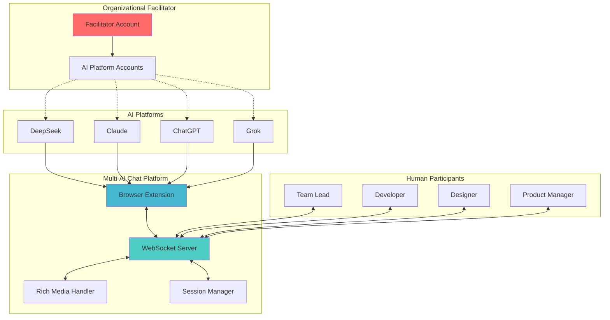
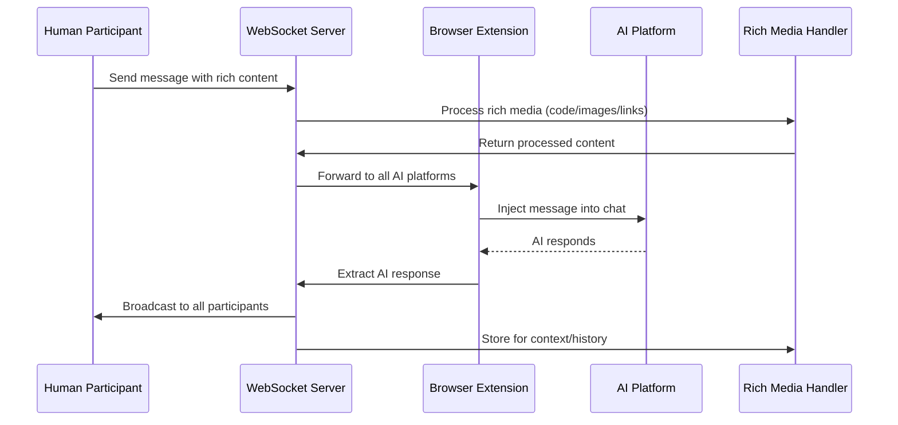

Whitepaper: Multi-AI Chat Webhook Extension
Abstract
The Multi-AI Chat Webhook Extension is a revolutionary browser-based platform that transforms isolated AI chat interfaces into collaborative multi-participant discussion rooms. By monitoring DOM changes in real-time across multiple AI platforms (DeepSeek, Claude, ChatGPT, Grok), it creates the world's first true multi-AI, multi-human collaborative environment. The platform supports organizational facilitators who provide AI access to teams, rich media sharing (code projects, images, links), and real-time synchronization between human participants and AI models. This enables unprecedented collaboration scenarios including multi-AI code reviews, design discussions, strategic planning sessions, and knowledge synthesis across different AI capabilities.
Purpose and Motivation

## The Collaboration Gap
Current AI platforms operate in isolation:
- **Individual AI Silos**: ChatGPT, Claude, DeepSeek, and Grok exist as separate platforms
- **No Cross-Platform Collaboration**: Users must copy/paste between different AI chats
- **Limited Multi-Participant Support**: Most platforms support only 1:1 human-AI conversations
- **Expensive Individual Access**: Each participant needs separate subscriptions to multiple AI services

## Our Revolutionary Solution
This extension creates the world's first **Multi-AI, Multi-Human Collaborative Platform** by:

### Core Capabilities
- **Real-time AI Monitoring**: Captures conversations across all major AI platforms simultaneously
- **Human Participation**: Multiple humans can join and participate in AI discussions
- **Organizational Facilitator Model**: Single entity provides AI access to entire teams
- **Rich Media Support**: Share code projects, images, links, and contextual content
- **Cross-Platform Synchronization**: All participants (human and AI) see the same unified discussion

### Revolutionary Use Cases
- **Multi-AI Code Reviews**: Get perspectives from Claude (reasoning), ChatGPT (documentation), DeepSeek (optimization), and Grok (creativity)
- **Design Thinking Sessions**: Teams collaborate with multiple AIs on product design
- **Strategic Planning**: Organizations leverage different AI strengths for business decisions
- **Educational Workshops**: Students learn from multiple AI teaching styles simultaneously
- **Research Synthesis**: Combine insights from different AI models for comprehensive analysis
## Enhanced Architecture

### System Overview

### Data Flow Architecture

### Component Architecture

#### Browser Extension Layer
- **Manifest v3**: Modern Chrome extension architecture
- **Content Scripts**: Platform-specific DOM observers for each AI service
- **Background Service Worker**: Coordinates cross-platform messaging
- **Popup Interface**: Quick access controls and room management
- **Options Page**: Configuration for facilitator credentials and preferences

#### Real-Time Communication Layer  
- **WebSocket Server**: Handles real-time bidirectional communication
- **Session Management**: Tracks active participants and AI connections
- **Message Queue**: Ensures reliable delivery across all participants
- **Rich Media Pipeline**: Processes and distributes complex content types

#### Rich Media Support
- **Code Project Handler**: Converts folder structures to/from JSON representations
- **Image Processing**: Handles drag-drop sharing and AI vision analysis
- **Link Enrichment**: Auto-generates previews and context
- **Context Integration**: Location, calendar, and real-world data integration

Use Cases

Logging/Analysis: Send chats to a server for sentiment analysis or storage.
Multi-AI Integration: Proxy DeepSeek responses to other AIs (e.g., via a server-side webhook handler).
Automation: Trigger external actions based on chat content (e.g., API calls).

Limitations and Future Work

Relies on stable DOM selectors; may break if DeepSeek updates UI.
One-way (send only); add receive/injection for full duplex.
No authentication; secure webhooks recommended.
Expand to other AI chats (e.g., add matches in manifest.json).

This tool empowers users to extend AI chats beyond silos, fostering innovative multi-AI applications.
Date: August 14, 2025